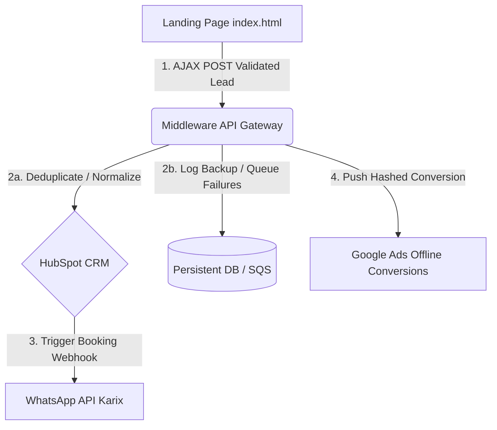

# OrthoNow Developer Assignment

A complete, high-performance, and submission-ready repository for digital growth engagement at **OrthoNow**—a chain of 9 orthopaedic clinics in South India (Bengaluru, Chennai, Hyderabad).

This repository contains:
1. **Task 1**: A professional Google Tag Manager (GTM) Event Tracking Schema and dataLayer architecture.
2. **Task 2**: A mobile-first, lightweight landing page designed to achieve **90+ PageSpeed Mobile** scores, featuring client-side form validation and non-PII dataLayer tracking.
3. **Task 3**: An end-to-end integration design mapping lead ingestion to HubSpot CRM, Karix WhatsApp API, and Google Ads conversions, featuring a custom strategy for phone-based deduplication.

---

## Folder Structure

```text
namoza-developer-assignment/
├── index.html        # Single self-contained landing page (HTML5, Vanilla CSS & JS)
├── README.md         # Full project documentation & architectural design
└── screenshots/      # Target folder for verification screenshots
```

---

## Setup & Testing Instructions

1. **Local Run**: 
   Simply double-click or open `index.html` in any web browser. No local web server, database, or build tools are required.
2. **Form Validation Testing**:
   * Attempt to submit the form with empty fields. Real-time helper errors will appear.
   * Input names with numbers or less than 3 characters to trigger validation errors.
   * Input mobile numbers that do not match the 10-digit Indian format (e.g., not starting with 6-9, or containing alphabets).
3. **Analytics Testing**:
   * Open the browser DevTools Console (`F12` -> `Console`).
   * Complete a successful form submission.
   * The console will log a structured, color-coded GTM tracking payload corresponding to the custom `consultation_form_submitted` event.
   * Standard call clicks (on the header) and WhatsApp clicks (on the floating widget) will also fire GTM push logs to the console in real-time.

---

## Task 1: GTM Event Schema

Below is the structured GTM Event Schema designed to map all critical patient interactions across the OrthoNow digital properties.

| Event Name | Trigger Type | Key Parameters (Min. 3) | GA4 Report | Audience Segment | Business Purpose |
| :--- | :--- | :--- | :--- | :--- | :--- |
| `booking_step_1_complete` | Custom Event | `step_number`<br>`clinic_location`<br>`specialty` | Funnel Exploration,<br>Engagement -> Events | Booking Drop-offs<br>(Step 1 Complete) | Tracks high-level clinic demand and interest in specific clinical specialties. |
| `booking_step_2_complete` | Custom Event | `step_number`<br>`preferred_date`<br>`form_id` | Funnel Exploration,<br>Engagement -> Events | Booking Drop-offs<br>(Step 2 Complete) | Monitors progression to contact-entry to identify drop-off barriers. |
| `booking_step_3_complete` | Custom Event | `step_number`<br>`booking_id`<br>`clinic_location` | Funnel Exploration,<br>Conversions (Imported) | Converted Patients | Measures final conversion rate. Key optimization metric for Google Ads. |
| `call_now_clicked` | Just Links Click | `click_location`<br>`phone_number`<br>`page_url` | Engagement -> Events | High-Intent Mobile Callers | Identifies immediate telephonic inquiries. Essential for mobile UX optimization. |
| `whatsapp_chat_initiated` | Just Links Click | `click_location`<br>`whatsapp_number`<br>`page_url` | Engagement -> Events | High-Intent Chat Conversions | Evaluates instant chat-inquiry volumes across various landing pages. |
| `patient_guide_downloaded` | Custom Event | `guide_name`<br>`form_id`<br>`page_url` | Engagement -> Events,<br>Conversions | Lead Nurturing Prospects | Tracks engagement with patient resources (e.g., knee/back pain care guide). |
| `clinic_page_viewed` | Page View | `clinic_name`<br>`city`<br>`page_url` | Engagement -> Pages & Screens | Local Clinic Prospects | Gauges localized search traffic and guides local marketing spend. |
| `blog_scroll_tracked` | Scroll Depth | `scroll_depth_percent`<br>`article_title`<br>`page_url` | Engagement -> Pages & Screens | Highly Engaged Readers | Measures patient content engagement and blog stickiness. |

---

### Step-by-Step dataLayer Payloads (Actual JSON)

#### Step 1: Location & Specialty Selected
```json
{
  "event": "booking_step_complete",
  "step_number": 1,
  "step_name": "location_specialty_selected",
  "clinic_location": "Indiranagar",
  "specialty": "Knee Pain Care"
}
```

#### Step 2: Contact Details Entered
```json
{
  "event": "booking_step_complete",
  "step_number": 2,
  "step_name": "contact_details_entered",
  "preferred_date": "2026-07-15",
  "form_id": "appointment_funnel_form"
}
```

#### Step 3: Booking Confirmed (Funnel Success)
```json
{
  "event": "booking_step_complete",
  "step_number": 3,
  "step_name": "booking_confirmed",
  "booking_id": "BK-2026-98715",
  "clinic_location": "Indiranagar",
  "specialty": "Knee Pain Care",
  "preferred_date": "2026-07-15"
}
```

---

### Analytics Architecture Explanations

* **GTM Trigger**: A GTM trigger is a condition defined inside Google Tag Manager that evaluates whether a tag (like a Google Analytics tag, Facebook Pixel, or Google Ads Conversion script) should execute. It utilizes variables like Click Classes, Click URLs, Form IDs, or Custom Events to fire tags at the exact user action.
* **Custom Event Trigger**: Since modern forms use asynchronous Javascript validations and animations (preventing native GTM form listeners from functioning accurately), we use Custom Event Triggers. These triggers listen to specific event strings pushed manually via `window.dataLayer.push({ event: 'custom_event_name' })` on the client side. This is the only bulletproof way to track multi-step asynchronous funnels.
* **dataLayer Architecture**: The dataLayer is a global client-side JavaScript array (`window.dataLayer`) that acts as a structural bridge between the web page code and GTM. It safely decouples marketing vendor requirements from core codebase edits, allowing front-end events to supply normalized, asynchronous variables to the tag management layer.
* **GA4 Funnel Exploration**: GA4 Funnel Exploration is a custom reporting visualization workspace that allows digital developers to set up a sequence of specific event-based steps. GA4 plots the horizontal/vertical conversion progression, displaying where users drop off.
* **Step Drop-off Tracking**: By mapping `booking_step_complete` events where `step_number` equals `1`, `2`, and `3`, we track the drop-off rates at each step. This highlights whether users are dropping off due to clinic availability (Step 1 to 2) or friction with entering name/phone (Step 2 to 3).
* **Which Google Ads Conversion to Import**: The `booking_step_3_complete` (or `consultation_form_submitted` for the landing page) event should be imported into Google Ads.
* **Why it is the Best Optimization Event**: If we optimize campaigns for shallow clicks (e.g., Landing Page views) or mid-funnel actions (e.g., Step 1 completed), Google's Smart Bidding algorithm will optimize for low-intent users who click around but do not convert. Optimizing for the final completed booking ensures Google Ads targets high-intent working professionals ready to schedule appointments, driving down actual Customer Acquisition Cost (CAC).

---

## Task 2: Landing Page Design & Validation

### Mobile-First & Core Web Vitals Optimization
To guarantee a **PageSpeed Insights Mobile score of 90+**, the page is designed with extreme asset efficiency:
* **System Font Stack**: Uses native operating system fonts (`-apple-system`, `BlinkMacSystemFont`, etc.), completely avoiding render-blocking typography network requests.
* **Inline Vector SVGs**: All clinical and brand icons are written in inline SVG formats. No external images or CSS/JS CDNs are loaded.
* **Zero External Dependencies**: Contains no heavy libraries (jQuery, Bootstrap, or Tailwind CDN blocks) that delay First Contentful Paint (FCP).
* **CSS & JS Inline Delivery**: Delivered as a single, contiguous bundle inside `index.html`. This ensures a single round-trip HTTP request and zero render-blocking blocking assets.

### Dynamic Validation Logic
* **Name Field**: Minimum 3 characters. Restricts input to alphabetical letters and spaces only.
* **Phone Field**: Validates for a 10-digit Indian mobile number format starting with 6, 7, 8, or 9.
* **Real-time Helper State**: Standardized helper error states appear in bright red underneath input wrappers on submit. If the user corrects their input inline, the error styling fades out immediately.
* **Async Visual Spinner**: Upon clicking "Book Priority Slot", the CTA updates to a loading state with a spinner before transitioning the parent form container into the Thank You State.

### Analytics Best Practice: Non-PII dataLayer Push
To align with Google Analytics Terms of Service and data privacy laws, **raw Name and Phone Number data is strictly excluded** from the client-side dataLayer push object. Instead, we push non-PII, contextually rich metadata:
```javascript
window.dataLayer.push({
  event: "consultation_form_submitted",
  form_id: "orthonow_consultation_form",
  page_name: "bengaluru_knee_back_pain_campaign",
  lead_source: "google_paid_search",
  submission_status: "success",
  timestamp: new Date().toISOString(),
  clinic_preference: "bengaluru_general"
});
```

---

## Task 3: Integration Design

### Complete Architecture Flow



#### 1. End-to-End Lead Routing
The client-side form triggers a validated payload containing Name, Phone, and UTM parameters to a secure serverless API Gateway (e.g., AWS Lambda or Vercel Serverless Function). The middleware acts as a security gate, normalizing data and verifying headers before communicating with the HubSpot CRM, WhatsApp, and Google Ads APIs.

#### 2. HubSpot Forms API Selection (Why NOT Native Embed?)
Using HubSpot's native embed iframe or JS scripts injects ~150KB of external, unoptimized render-blocking resources. This degrades Core Web Vitals, causing PageSpeed Mobile scores to drop below 70. The HubSpot Forms API allows us to build a custom, lightweight, high-performance HTML/CSS form that retains 100% design alignment and runs custom validation, while submitting leads to the CRM via clean backend routes.

#### 3. Phone Number Deduplication Strategy in HubSpot
HubSpot CRM is built to deduplicate records natively using the `email` property. Since the OrthoNow landing page collects only Name and Phone, standard API pushes without emails will lead to duplicate contacts or ingestion failures.

To resolve this, the Middleware Gateway implements a programmatic deduplication logic:
1. **Search Contact**: The middleware queries the HubSpot Search API (`POST /crm/v3/objects/contacts/search`) matching the E.164 normalized phone number (e.g., `+919876543210`).
2. **Deterministic Email Generation**: If no record is found, the middleware creates a new contact using a unique, deterministic system email (e.g., `phone_919876543210@orthonow-leads.in`) to leverage HubSpot's native deduplication engine for future imports.
3. **Collision Resolution (Same Phone, Different Name)**: 
   If two different patients submit using the same phone number but different names (e.g., family members sharing a device/mobile):
   * *Option 1 (Deal-Based)*: The middleware associates the new patient request to the existing primary contact, but creates a new **Deal/Ticket record** containing the new patient's name and clinical requirements (knee vs. back pain). This keeps the Contact database clean while cataloging separate clinical records.
   * *Option 2 (Unique Suffix)*: If the name differs significantly, the middleware spawns a secondary contact by appending a suffix to the deterministic email (e.g., `phone_919876543210_2@orthonow-leads.in`), establishing a distinct patient profile.

#### 4. Retry Mechanism & Error Handling
If HubSpot or Karix is temporarily down, the middleware writes the lead payload to an AWS SQS queue. A worker retries the API post using Exponential Backoff with Jitter (retrying after 5s, 30s, 5m, 30m, and 2h).

#### 5. Logging, Monitoring & SLA
Every integration transaction is logged securely in AWS CloudWatch (with PII obfuscated). New Relic dashboard tracks integration response latency. If SLA response times exceed 1500ms or API error rates cross 2% in 5 minutes, automated PagerDuty SMS alerts are dispatched to the engineering team.

#### 6. Failure Point & Fallback Solution
* **Biggest Failure Point**: Inability to call HubSpot or Karix due to internet outages or API credential expirations.
* **Fallback Solution**: If the SQS retry limit is breached, the middleware writes the raw lead payload to a secure persistent backup database (e.g., Amazon DynamoDB). It immediately alerts the operations desk via Slack webhook so leads can be processed manually.

---

## Screenshots Folder

The actual validation and layout screenshots must be placed in the `screenshots/` directory:
* **Landing Page Mockup**: `screenshots/landing-page.png`
* **dataLayer Browser Console Event Logs**: `screenshots/datalayer-console.png`
* **PageSpeed Mobile 90+ Score Report**: `screenshots/pagespeed-mobile.png`

---

## Assumptions & Future Improvements

### Assumptions
1. **UTM Lead Attribution**: It is assumed that GTM is configured to extract UTM parameters from the URL query string and pass them to the dataLayer to correctly log campaigns.
2. **Karix API Credentials**: The integration design assumes that the WhatsApp Business API (Karix) utilizes a standardized OAuth2 token structure managed securely in the API Gateway.
3. **Indian Mobile Format**: We assume the target audience in Bengaluru uses Indian standard phone numbers (+91 omitted or captured as 10 digits starting with 6, 7, 8, or 9).

### Future Improvements
1. **SHA-256 Hashing for Conversions**: Implement client-side SHA-256 hashing on Name and Phone prior to form postbacks, enabling Google Enhanced Conversions to track conversions securely without sending PII.
2. **Lazy Loading SVGs**: If we add more visual illustrations later, we can lazy load secondary icons to keep First Contentful Paint (FCP) under 0.8 seconds.
3. **HubSpot OAuth Webhook Security**: Secure webhook endpoints using SHA-256 signature verification to prevent spoofing from mock external systems.
